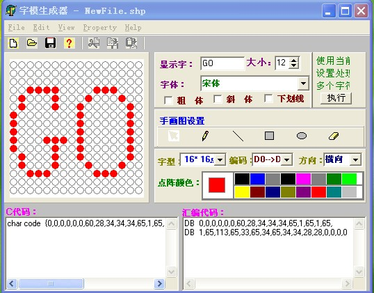

# Dot_matrix_font

基于Qt/C++的单片机点阵取字模软件

输入汉字或者句子，然后生成LCD所需的代码（C/ASM）

## 原理



以16×16点阵为例，点阵共有256个点，显示字符就是将部分点点亮。

本软件需要做的就是确定需要点亮那些点。

代码生成原理是每八个点取一个值，方向为横向。

比如第一行，16个点没有一个亮，就是0000000000000000
=(00000000)(00000000)=(0x00)(0x00)

生成代码结果就是

```C
char code tab[]={0x00,0x00,...};
```

本软件设计理念就是：在QLabel上面写一个字，然后按照16*16的尺寸进行切割访问像素值，如果是背景色（白色）就是0，如果是字（黑色）就是1，然后每八位进行计算十六进制值并转换为QString，将每个十六进制值拼接为结果并显示。

## 使用说明


在右侧输入框Text中输入需要生成代码的字符

在左侧会显示表示LCD点阵的图像

在下方左侧是C代码，右侧是汇编代码
